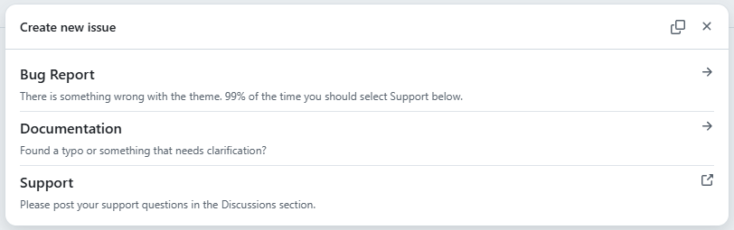
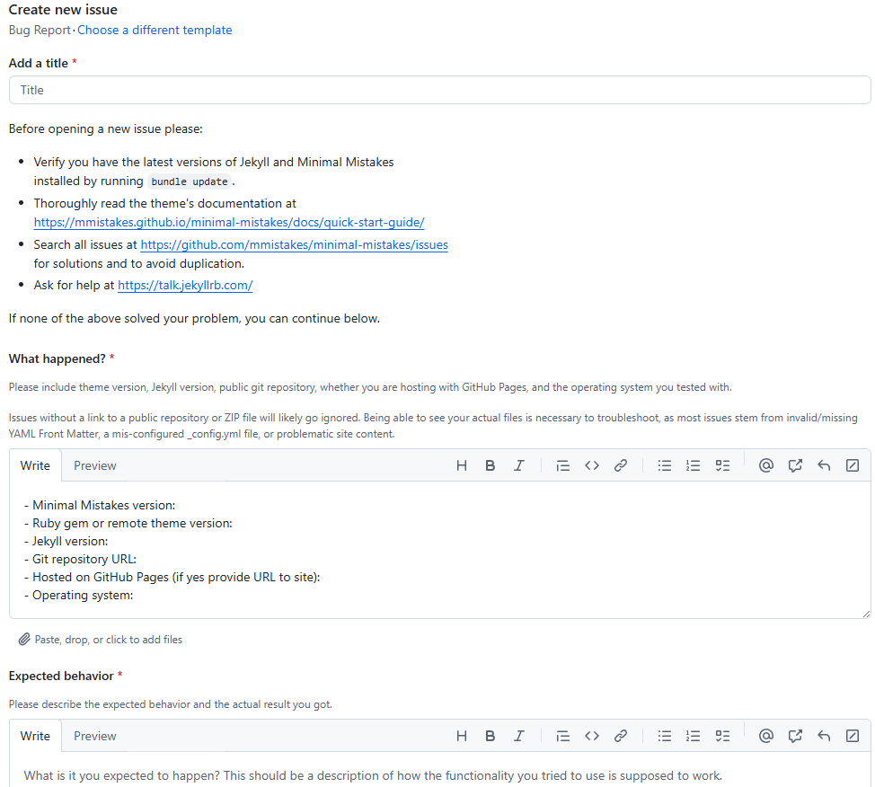
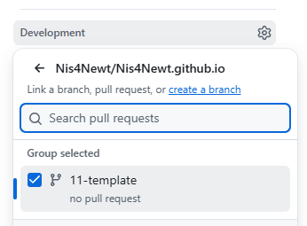

### ISSUE Template
---

GitHub에서 `New ISSUE`를 통해 새로운 이슈 생성
- {: .align-left}
- 기본적으로 생성가능한 이슈
- bug report를 선택해보면 이슈 구성이 굉장히 복잡
- - {: .align-left}

이런 ISSUE는 Template를 추가하거나 수정하여 커스텀 가능
- 위치 : `~\.github\ISSUE_TEMPLATE\어쩌고_template.yml`
- template 파일은 `.md`, `.yml` 등으로 만들 수 있음
   - `.md`가 레거시고 최신은 `.yml`을 사용

#### 대략적인 구성
```
name: 이슈 만들기
description: 그냥 이슈 만들기
body:
  - type: markdown
    attributes:
      value: |
        깃 허브는 이슈만들어서 뭐하는지 아직은 잘 모르겠지만
        알아서 잘 작성하도록

  - type: textarea # 입력 필드
    id: information
    attributes:
      label: 이슈의 내용은 뭔가요?
      description: |
        이슈에 내용에 대해 작성해주세요
      value: |-
        - 내용 작성
    validations:
      required: false # 필수입력 여부
```

### PR Template
---

이슈와 마찬가지
- 위치 : `~\.github\PULL_REQUEST_TEMPLATE.md`

`PULL_REQUEST_TEMPLATE`의 내용은 PR의 입력필드에 그대로 삽입

#### PR 생성

{: .align-left}
1. 이미지와 같이 이슈의 `Development`에서 `create a branch`로 브랜치 생성
2. 로컬에서 pull
3. 작업 후 push
4. github에서 PR 생성 -> 확인 후 `Merge`

--- 

\<부록\>    

{: .align-center}
<div align="center">  
  마무리 짱구
</div>